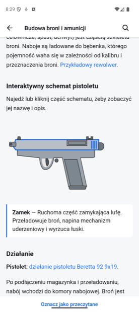
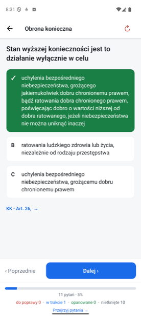
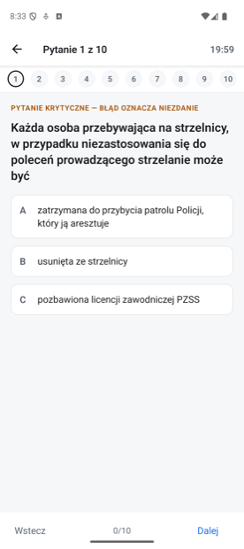

# Patent Strzelecki


Aplikacja mobilna do nauki na teoretyczną część egzaminu na patent strzelecki PZSS.
Treść pochodzi z bezpłatnego kursu [patentstrzelecki.eu](https://patentstrzelecki.eu/)
prowadzonego przez Braterstwo (Stowarzyszenie KS Amator).

Cel: uczyć się na telefonie bez internetu, z trwałym postępem i prawdziwym egzaminem
próbnym — czego wersja przeglądarkowa nie daje.

Aplikację napisał Hubert Książek. Jest **nieoficjalna** — Braterstwo jej nie prowadzi
i nie odpowiada za jej działanie; błędy i uwagi idą do autora aplikacji, nie do autorów
kursu. Adres do zgłoszeń jest w aplikacji, w ustawieniach.

| | | | |
| --- | --- | --- | --- |
|  |  |  |  |
| Lekcja — schemat reaguje na dotknięcie, choć skrypty kursu są wycinane przy budowie paczki | Test ABC — werdykt niesie znak, nie sam kolor, a podstawa prawna odsłania się dopiero po odpowiedzi | Ustawa offline — przepis z uchwaloną przyszłą wersją mówi, od kiedy się zmieni | Egzamin na zasadach § 19 regulaminu PZSS — pasek pokazuje stan arkusza, pytania krytyczne są oznaczone |

## Co jest w środku

```
app/       ekrany (Expo Router) — nauka, ćwiczenia, egzamin, akty prawne, szukanie, ustawienia
src/       logika: engine (powtórki, egzamin), content (paczka treści), db, navigation
assets/    ikony i paczka treści (assets/content/ — poza gitem, patrz „Skąd się bierze treść")
docs/      polityka prywatności
```

`CLAUDE.md` (w katalogu głównym) jest zapisem pułapek i decyzji projektowych — dlaczego coś
jest zbudowane tak, a nie inaczej, i co łatwo zepsuć, zmieniając to bez tej wiedzy. Pisany dla
agentów kodujących, ale to też najkrótsza droga dla człowieka, który wchodzi w ten kod po raz
pierwszy. `LICENSE` i `NOTICE` opisują, na jakiej licencji stoi kod i co z tego wyłączone —
patrz „Licencja i prawa do treści" niżej.

Paczka treści na dzień pisania: **11 lekcji, 656 pytań, 15 zestawów ćwiczeń, 14 obrazków**
oraz **11 pozycji prawnych** — pięć z pełnym tekstem offline (ustawa o broni i amunicji,
Kodeks karny, Kodeks wykroczeń, rozporządzenie o noszeniu i przechowywaniu oraz
rozporządzenie o egzaminie), pozostałe jako odnośniki, bo rejestr Sejmu ma je wyłącznie
w postaci skanów.

Co robi aplikacja:

- **Nauka** — cała teoria kursu offline, z odnośnikami działającymi wewnątrz aplikacji,
  dymkami skrótów, postępem czytania i szukaniem na stronie.
- **Ćwiczenia** — fiszki i test ABC z osobnym postępem (powtórki Leitnera, liczba poziomów
  do ustawienia), zestawy kursu i zestaw „moje błędy", przegląd wszystkich pytań zestawu
  z podziałem na stany i ręczną korektą.
- **Egzamin** — 10 pytań, 20 minut, próg 9/10; arkusz składany po zagadnieniach § 19 regulaminu
  patentowego PZSS: cztery pytania z ustawy i zasad bezpieczeństwa bez prawa błędu, dalej po dwa
  z pozostałych trzech zagadnień. Do tego wyniki po zagadnieniach liczone z własnych podejść —
  z każdego wiersza wchodzi się w zagadnienie, jego pytania w podziale na błędne, poprawne
  i pozostałe oraz powtórkę własnych pomyłek — historia i egzamin z puli własnych pomyłek. Osobno egzamin przed komisją WPA na zasadach z § 4
  rozporządzenia o egzaminie.
- **Akty prawne** — czytanie całych ustaw offline, spis jednostek, skoki z podstaw prawnych
  pytań, przypisy jako dymki.
- **Szukanie** — po pytaniach, lekcjach i tekstach ustaw, z przejściem w konkretne miejsce.

## Uruchomienie

Wymagane: Node 20+. Cele `make icons` i `make icons-write` potrzebują dodatkowo `uv`
z Pillow (`uv run --with pillow`) — nie są w żadnej codziennej ścieżce, więc bez nich
reszta działa normalnie.

```sh
make            # lista wszystkich komend
make setup      # zależności aplikacji
make start      # serwer deweloperski Metro (do buildu debugowego)
```

`make setup` woła `npm install --legacy-peer-deps` — Expo przypina `react` do wersji, z którą
kłóci się `react-dom` wciągany przez zależności webowe, więc gołe `npm install` kończy się
`ERESOLVE`. Wygodniej więc zawsze przez `make setup`, niż pamiętać o fladze.

`make doctor` sprawdza całe środowisko naraz: narzędzia, ścieżkę Xcode, certyfikat
do podpisu, podłączone urządzenia i obecność paczki treści. Zaczynaj od niego, gdy coś
nie działa.

Do nauki na telefonie służy **build Release** (`make ios`, `make android`) — ma wszyty
bundel JS i obrazki, więc działa bez laptopa i bez sieci. `make start` podnosi Metro dla
buildu debugowego, czyli tylko na czas pracy nad kodem.

> **Projekt jest przypięty do Expo SDK 54 i tak ma zostać.** Argument jest sprawdzalny
> w zbudowanym APK: SDK 54 targetuje **API 36**, czyli spełnia próg Google Play, a przy
> tym trzyma niski próg wejścia —
> `minSdkVersion 24` (Android 7.0) i `IPHONEOS_DEPLOYMENT_TARGET 15.1` (iPhone 6s). Każde
> podniesienie SDK te progi **podnosi**, czyli odcina starsze telefony, nie dając nic
> w zamian. Szczegóły: `CLAUDE.md`.

## Instalacja na iPhonie bez laptopa

Do nauki w tramwaju trzeba zbudować aplikację z wszytym bundlem JS — build debugowy
ciągnąłby kod z Metro, więc bez laptopa by nie wstał. Wymaga to pełnego Xcode (same
Command Line Tools nie wystarczą).

```sh
# jednorazowo, jeśli make doctor mówi, że xcode-select wskazuje na Command Line Tools
sudo xcode-select --switch /Applications/Xcode.app/Contents/Developer

make prebuild                     # generuje katalog ios/ z konfiguracji Expo
make ios                          # build Release i instalacja na telefonie
```

Inne urządzenie: `make ios DEVICE="nazwa"`. Nazwy podłączonych pokaże `make doctor`.
`make ios-sim` robi to samo na symulatorze — szybki test przed wgraniem na telefon.

`--configuration Release` jest tu istotne: build debugowy nadal ciągnąłby JS z Metro.
W Release bundel i wszystkie obrazki lądują w aplikacji, więc działa w pełni offline.

Katalog `ios/` jest w `.gitignore`: generuje go `expo prebuild` z konfiguracji Expo
(`app.json` plus `app.config.js`), więc trzymanie go w repo dawałoby dwa
źródła prawdy o konfiguracji.

**Podpis — jednorazowo.** Expo nie tworzy certyfikatów lokalnie, potrafi to tylko Xcode.
Za pierwszym razem trzeba więc otworzyć `ios/PatentStrzelecki.xcworkspace`, wejść w
TARGETS → PatentStrzelecki → Signing & Capabilities i wybrać swój zespół (Personal Team).
Xcode wygeneruje wtedy certyfikat deweloperski. Od tego momentu `expo run:ios` podpisuje
się samo, również po ponownym `prebuild` — certyfikat żyje w pęku kluczy, nie w katalogu
`ios/`.

Gdyby Xcode zaproponował „Update to recommended settings" — **odrzuć**. Wśród sugestii jest
`Enable User Script Sandboxing`, które psuje fazę wszywania bundla JS w React Native.

**Pierwsze uruchomienie na telefonie.** iOS odmówi otwarcia aplikacji od nieznanego
dewelopera. Ustawienia → Ogólne → VPN i zarządzanie urządzeniem → wpis `Apple Development:
<twój email>` → Zaufaj.

**Czas życia.** Na darmowym Apple ID profil wygasa **po 7 dniach** i aplikacja przestaje się
otwierać — trzeba powtórzyć `make ios`. Nowy profil robi się przy tym sam, bez zaglądania do
Xcode: `make ios` podstawia xcodebuildowi skrypt z `scripts/xcode-shim/`, który dokłada
`-allowProvisioningUpdates`. Samo `expo run:ios` przekazuje tę flagę tylko przy pierwszym
uruchomieniu, kiedy jeszcze samo wpisuje zespół do projektu; potem uznaje podpis za załatwiony
i flagi już nie dokłada, więc ósmego dnia build kończył się `No profiles for … were found`.

Płatne konto Apple Developer daje profil na rok i dostęp do TestFlight, czyli instalację bez
kabla i bez trybu dewelopera.

## Android

Do zbudowania wersji androidowej wystarczą **command line tools** z
[developer.android.com](https://developer.android.com/studio) — całe Android Studio nie jest
potrzebne. Archiwum rozpakuj tak, żeby powstała ścieżka
`~/Library/Android/sdk/cmdline-tools/latest/bin/`; bez tego zagnieżdżenia `android` (narzędzie
wywołane niżej) nie znajdzie SDK. Potem dobierz pakiety pod projekt (kompiluje się przeciw
API 36):

```sh
SDK=~/Library/Android/sdk
$SDK/cmdline-tools/latest/bin/android sdk install \
  platform-tools platforms/android-36 build-tools/36.0.0 emulator \
  system-images/android-36/google_apis_playstore/arm64-v8a
```

Dalej wszystko jest w Makefile:

```sh
make android-avd   # utwórz emulator „patent" (Pixel 9, API 36, arm64)
make android-emu   # podnieś go w tle
make android       # build Release i instalacja na emulatorze albo telefonie
```

`make doctor` pokazuje stan `adb`, emulatora, Javy i listę AVD, więc widać, czego brakuje.
Makefile woła narzędzia po pełnej ścieżce i sam eksportuje `ANDROID_HOME`, więc nie trzeba
nic dopisywać do profilu shella. Inna lokalizacja SDK: `make android ANDROID_SDK=/ścieżka`.

## Wersje i wydania

Konfiguracja Expo jest w dwóch plikach: `app.json` trzyma to, co stałe (nazwa,
identyfikatory, ikony, wtyczki), a `app.config.js` dokłada to, co trzeba wyliczyć
albo wyjaśnić komentarzem. Wyliczane są numery:

| pole | skąd | przykład |
| --- | --- | --- |
| `version` | ostatni tag gita `vX.Y.Z` | `v1.2.0` → `1.2.0` |
| `ios.buildNumber`, `android.versionCode` | `git rev-list --count HEAD` | `45` |
| `extra.commit`, `extra.commitDate` | `git rev-parse --short HEAD`, `git log -1 --format=%cs` | `de5b7ee`, `2026-08-09` |

Commit trafia na ekran ustawień jako „zbudowana 9.08.2026 z de5b7ee" i kopiuje się po
dotknięciu. **Sufiks `+` znaczy build z niezacommitowanymi zmianami** — bez niego linijka
twierdziłaby, że w telefonie siedzi kod z publicznego repozytorium, czyli kłamałaby dokładnie
wtedy, gdy ktoś chciałby to porównać. Data jest datą commita, nie budowy: data budowy zmieniałaby
zawartość aplikacji przy każdym przebiegu z tego samego kodu.

Sama linijka **niczego nie dowodzi** — łańcuch w binarce mówi tyle, ile wpisał budujący.
Weryfikacja pliku to porównanie odcisku podpisu; przy plikach z Google Play będzie to odcisk
Google, bo Play App Signing przepodpisuje paczkę:

```sh
~/Library/Android/sdk/build-tools/36.0.0/apksigner verify --print-certs app-release.apk
```

Numeru builda nie da się w sklepie użyć dwa razy — App Store i Google Play odrzucają
powtórzony. Ponieważ `make ios` i `make android` robią `prebuild` przed każdym buildem,
liczba wpisana na sztywno oznaczałaby, że pierwsza wysyłka przechodzi, a każda poprawka po
niej odbija się od sklepu. Liczba commitów rośnie sama i nie wymaga pamiętania o niczym.

Wydanie nowej wersji to więc **utworzenie tagu**:

```sh
git tag -a v1.1.0 -m "Egzamin z puli słabych pytań"
make version        # sprawdź, co zobaczy sklep
make ios            # albo make android — prebuild przepisze numery do projektu natywnego
git push --tags     # tag ma być też na serwerze, inaczej ślad po wydaniu jest tylko lokalny
```

Tag musi mieć postać `vX.Y.Z` — inny (np. `content-2026-08`) jest ignorowany i wersją
zostaje zapasowa z `app.json`. `make version` pokazuje jedno i drugie, więc literówka
w tagu widać od razu. Bez repozytorium gita (rozpakowane źródła) build nadal przechodzi:
wersja jest z `app.json`, a numer builda to `1`.

Poprawka wysłana do sklepu **wymaga nowego commita**, nie tylko przebudowania — bez commita
numer builda się nie zmienia.

### Wydanie przez pipeline

Zamiast `make android-aab` i ręcznych sprawdzeń w gotowym pliku:

```sh
make release TAG=v1.1.0 SKIP_E2E=1
```

Buduje paczkę **z tagu, w świeżym worktree** (nie w katalogu `android/`, który pamięta
poprzednie buildy), uruchamia testy z paczką treści na miejscu, a potem sprawdza gotowy plik —
pakiet, wersję, `versionCode`, uprawnienia, podpis, wersję treści w bundlu, architektury,
mapę R8 — i zapisuje wynik do `checks.md` obok AAB w `~/Releases/patent-strzelecki/<tag>/`
(zmienna `PATENT_RELEASES_DIR`). Cały przebieg trwa kilka minut. Każda niezgodność zatrzymuje
pipeline z komunikatem; nic nie przechodzi po cichu. Po wgraniu do Play:
`make release-uploaded TAG=…` — następne wydanie porównuje się z tym. `SKIP_E2E=1` jest dziś
obowiązkowe (testy na emulatorze dopiero powstają) i zostawia w `checks.md` wytłuszczone
„NIEZWERYFIKOWANE".

Paczkę treści pipeline bierze z `assets/content` (albo `PATENT_CONTENT_DIR`) — patrz „Skąd się
bierze treść".

### Uprawnienia Androida

Wydanie deklaruje **zero uprawnień**. Pięć wnoszonych przez zależności (`INTERNET`,
`SYSTEM_ALERT_WINDOW`, `READ_EXTERNAL_STORAGE`, `WRITE_EXTERNAL_STORAGE`, `VIBRATE`) zdejmuje
`android.blockedPermissions` w `app.config.js` — aplikacja działa offline i pisze wyłącznie
do swojego prywatnego katalogu, więc żadnego z nich nie używa. Najbardziej kłopotliwe jest
`SYSTEM_ALERT_WINDOW`: Google Play pokazuje je jako „Wyświetlanie nad innymi aplikacjami"
i recenzja pyta o uzasadnienie, którego nie ma.

`INTERNET` na tej liście jest najmniej oczywisty i został **sprawdzony na emulatorze**: build
bez niego otwiera skan Dziennika Ustaw i pobiera PDF bez problemu, bo `expo-web-browser`
uruchamia Chrome Custom Tabs, czyli proces przeglądarki z własnym dostępem do sieci. Wraca
dopiero wtedy, gdy dojdzie cokolwiek pobierającego dane **w** aplikacji. Build debugowy ma je
przywrócone osobną wtyczką (`withInternetForDebug`), bo ściąga bundle z Metro.

Sprawdzenie w gotowym APK — jedyne, co wypisze, to wewnętrzne uprawnienie AndroidX
(`DYNAMIC_RECEIVER_NOT_EXPORTED_PERMISSION`), którego Play nie pokazuje użytkownikowi:

```sh
~/Library/Android/sdk/build-tools/36.0.0/aapt2 dump permissions \
  android/app/build/outputs/apk/release/app-release.apk
```

## Skąd się bierze treść

Paczka treści (`assets/content/`) powstaje z kursu patentstrzelecki.eu i **nie ma jej w tym
repozytorium** — należy do autorów kursu. Buduje ją osobne, prywatne narzędzie, które nie jest
publikowane.

W praktyce znaczy to, że po sklonowaniu tego repozytorium `make check` przechodzi (423 testy,
sześć pomija się z braku paczki — dwa całe pliki testowe i jeden blok w trzecim), ale
`make ios` czy `make android` nie zbudują działającej aplikacji. To jest świadome i wynika
z warunków, na jakich autor korzysta z treści kursu.

## Testy

```sh
make check          # typy, linter i wszystkie testy — przed commitem
```

429 testów logiki powtórek, egzaminu, przeglądu pytań, szukania, routera linków, czytania
i skryptów wstrzykiwanych do WebView. Są wolne od importów z React Native, więc chodzą pod
zwykłym vitestem, bez uruchamiania aplikacji.

## Zasady egzaminu

Odtworzone za stroną `/patent-egzamin` kursu: 10 pytań, 20 minut, próg 9/10, przy czym
pierwsze 4 pytania (UoBiA + zasady bezpieczeństwa) muszą być bezbłędne — każdy błąd w tej
czwórce oznacza niezdanie niezależnie od reszty wyniku. Kolejność pytań i odpowiedzi
losowana.

Wersja lokalna nie odtwarza serwerowej, współdzielonej historii podejść spod „klucza" —
historia jest lokalna.

## Licencja i prawa do treści

Kod jest na licencji **Apache-2.0** (`LICENSE`). Zastrzeżenia, których sama licencja nie
niesie — treść kursu, akty prawne, znaki towarowe — stoją w `NOTICE`.

Pytania i lekcje są opracowaniem **Braterstwa (Stowarzyszenia KS Amator)** i pozostają jego
własnością. **Licencja na kod ich nie obejmuje.**
Same przepisy (UoBiA, Kodeks karny, rozporządzenia) jako akty normatywne nie podlegają
prawu autorskiemu — art. 4 pkt 1 ustawy o prawie autorskim.

Repozytorium **nie zawiera** treści kursu: `assets/content/` jest w `.gitignore`, a paczkę
odtwarza się lokalnie osobnym, prywatnym narzędziem. Korzystanie na własny użytek mieści się
w dozwolonym użytku osobistym (art. 23 pr. aut.).

**Jakakolwiek publiczna dystrybucja — sklepy, APK dla innych osób, hosting paczki —
wymaga zgody Stowarzyszenia KS Amator.** Autor tej aplikacji taką zgodę ma. Aplikacja jest
bezpłatna, bez reklam i bez śledzenia użytkowników, wskazuje źródło treści z odnośnikiem do
[patentstrzelecki.eu](https://patentstrzelecki.eu/) i nie podaje się za oficjalną aplikację
Braterstwa.

**Zgoda dotyczy tej aplikacji, nie tego repozytorium.** Kto klonuje ten kod, nie dostaje
razem z nim prawa do treści kursu — na własne wydanie oparte na materiałach Braterstwa
potrzebuje własnej zgody.
